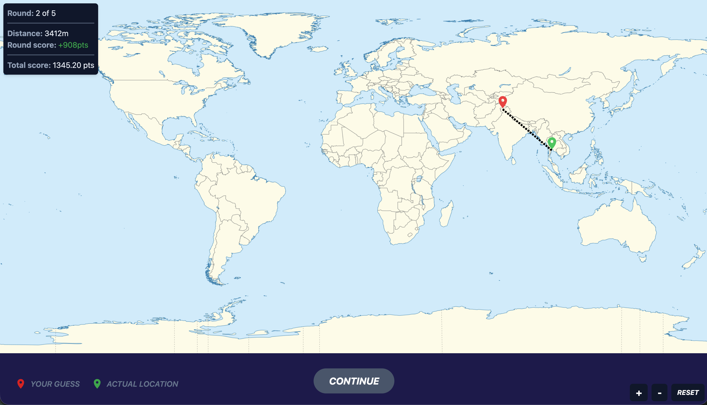
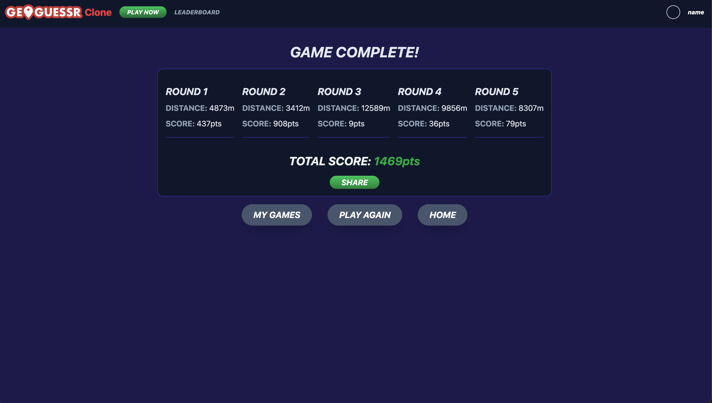
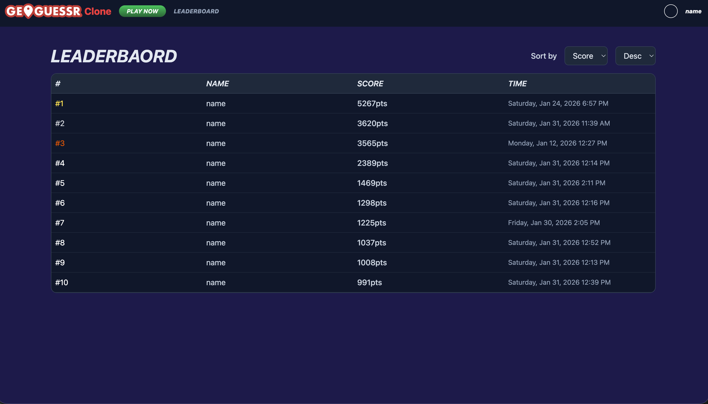
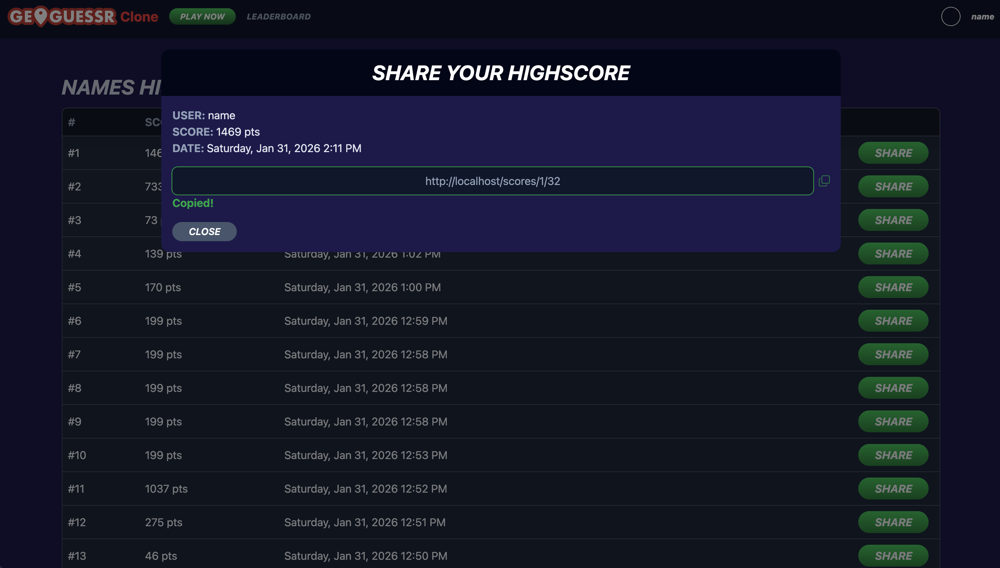

# GeoGuessr Clone

Geography game where players guess the location on the world map based on an image.
This application is made without the use of APIs, the calculations are done using math manually.

## Features

- **Authorization** - User registration and login
- **Leaderboard** - Compare scores with other players
- **Player History** - View your past games
- **Share Games** - Share your results with others
- **Gameplay**
  - Random location selection from 20+ world cities
  - Interactive map-based guessing
  - Distance calculation and scoring system
  - Round-by-round score tracking

## Screenshots

### Game View

*Main gameplay screen with location image and interactive map*

*Main gameplay screen with active map*

*Main gameplay screen after a guess*

### Results Screen

*Final score breakdown with round-by-round statistics*

### Leaderboard

*Compare your scores with other players*

## Sharing

*Share your score by creating a public link*

## Tech Stack

**Frontend**
- React + Vite
- Inertia.js
- TailwindCSS v4

**Backend**
- Laravel
- MySQL
- Laravel Sail (Docker)

## Installation

### Prerequisites
- Docker Desktop
- Linux-based terminal (or WSL2 on Windows)

### Setup
1. Clone the repository

  - git clone https://github.com/karlisye/geoguessr-clone.git
  - cd geoguessr-clone

2. Install dependencies

  - docker run --rm \
    -u "$(id -u):$(id -g)" \
    -v "$(pwd):/var/www/html" \
    -w /var/www/html \
    laravelsail/php85-composer:latest \
    composer install --ignore-platform-reqs

  - docker run --rm \
    -v "$(pwd):/app" \
    -w /app \
    node:22 \
    npm install

3. Configure environment

  - cp .env.example .env
  - ./vendor/bin/sail php artisan key:generate

4. Setup database

  - ./vendor/bin/sail up -d
  - ./vendor/bin/sail php artisan migrate

5. Run

  - ./vendor/bin/sail npm run dev

6. Access application

 - In your browser: http://localhost

## Usage

### Getting Started
1. **Sign up** for a new account or **log in** if you already have one
2. Click the **Play Now** button from the home page to start a new game

### Playing the Game
1. **View the location image** displayed on screen
2. **Click on the map** (bottom right corner) where you think the location is
3. **Submit your guess** to see:
   - Distance from the actual location
   - Points earned for accuracy
4. **Complete 5 rounds** to finish the game

### After the Game
- View your **final score** and detailed round-by-round statistics
- **Share your results** using the share button to generate a shareable link
- Compare your performance on the **Leaderboard**

### Additional Features
- **Leaderboard**: Click the leaderboard button in the navigation bar to see top scores (try the sort function!)
- **Game History**: Hover over your profile icon and select "History" to view all your past games
- **Sign Out**: Access the sign out option from the profile dropdown menu

### Distance Calculation
- The game uses an equirectangular projection map (Plate Carrée), where the horizontal axis maps longitude linearly and the vertical axis maps latitude linearly.
- This map is rendered with a 2:1 aspect ratio, matching the standard 360° (longitude) by 180° (latitude) coverage.
- When the user clicks the map, the marker position is converted into percentages (xPerc, yPerc) relative to the map container, so the same click maps correctly across different screen sizes.
- Those percentages are then converted into longitude/latitude using the equirectangular mapping: lon = xPerc/100*360-180 and lat = 90-yPerc/100*180 (assuming yPct=0 is the top of the map).
- Finally, the game computes the great-circle distance between (guessLat, guessLon) and (actualLat, actualLon) using the Haversine formula.
- The exact implementation can be found in resources/js/Pages/Game/calculations/mapCalculations.js.

### Scoring System
Your score is calculated based on how close your guess is to the actual location by using a formula score = 5000*Math.exp(-distance/2000). The closer you are, the closer you get to 5000 points!
